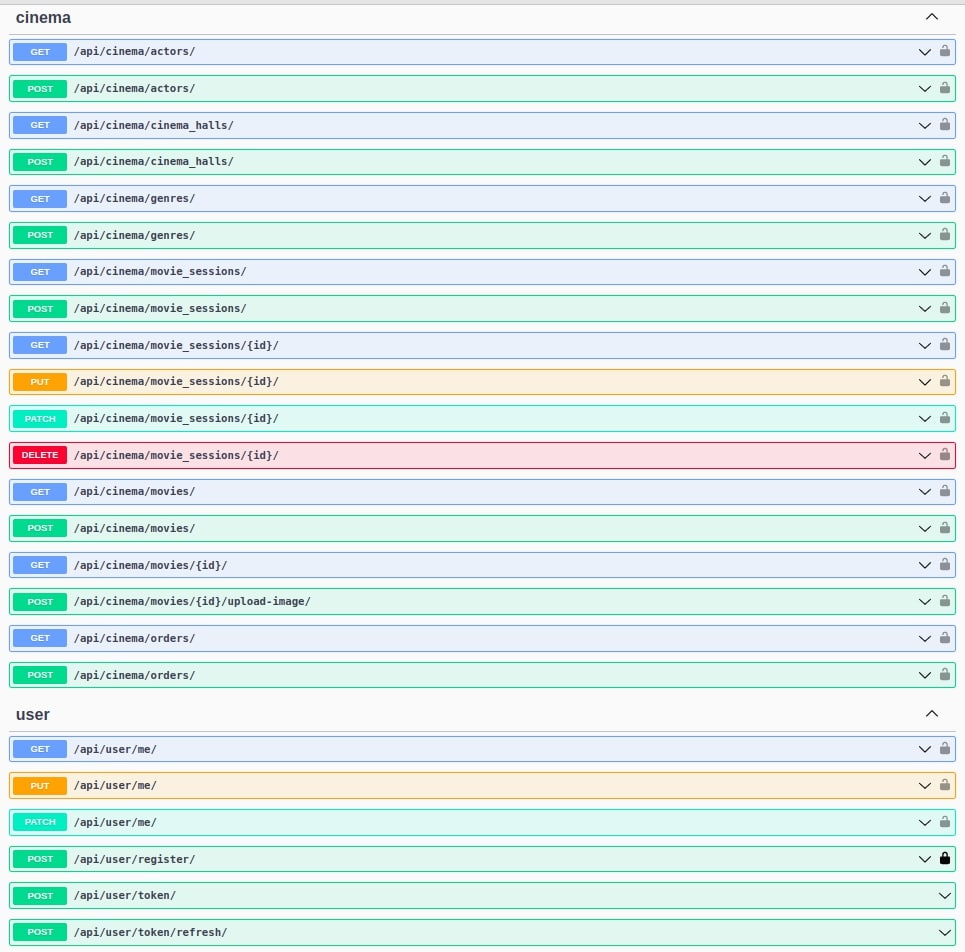

# Cinema API

API service for cinema management on DRF


## Installing using GitHub

Install PostgreSQL and create database

```bash
  git clone git@github.com:Kobsar703/cinema_API.git
  cd cinema_API
  python -m venv venv
  source venv/bin/activate
  pip install -r requirements.txt
  set DB_HOST=<your db host name>
  set DB_NAME=<your db name>
  set DB_USER=<your db username>
  set DB_PASSWORD=<your db user password>
  set SECRET_KEY=<your secret key>
  python manage.py migrate
  python manage.py runserver
```


## Run with docker

Docker should be installed and create .env file with your settings

```bash
  docker-compose build
  docker-compose up -d
  ------
  docker-compose down
```
Also, cinema_api can be downloaded from docker hub by command line:
```bash
docker pull kobzar1001/cinema_api
```

### How to check functionality:
- Run `docker-compose up` command, and check with `docker ps`, that 2 services are up and running;
- Go to `127.0.0.1:8000/api/` and check project endpoints via DRF interface;
- Create new admin user. Enter container `docker exec -it <container_name> bash`, and create in from there;

## Getting access

- create user via endpoint /api/user/register/
- get access token via /api/user/token/
    
## Features

- Admin panel /admin/
- Documantation is located at /api/doc/swagger/ and /api/doc/redoc/
- JWT authentication
- Managing orders and tickets
- Creating movies with genres and actors
- Creating cinema halls
- Adding movie sessions
- Filtering movies and movie sessions
- Adding image to movie representation

## Available endpoints


